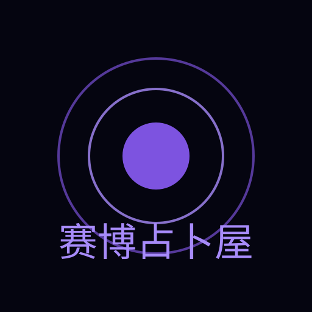
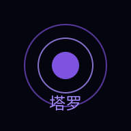

<div align="center">
  

  # Mood Mirror Tarot

  **Journal your feelings. Let AI read between the cards.**

  <p>
    <a href="https://github.com/xuelei321/vibe-taluo"></a>
    <a href="https://github.com/xuelei321/vibe-taluo/blob/main/LICENSE"></a>
    
    <br />
    
    
    
    
    
  </p>

  <p>
    <a href="#features">Features</a> •
    <a href="#demo">Demo</a> •
    <a href="#quick-start">Quick Start</a> •
    <a href="#tech-stack">Tech Stack</a> •
    <a href="#roadmap">Roadmap</a> •
    <a href="#contributing">Contributing</a>
  </p>

  <p>
    <em>情绪镜像塔罗 · 用塔罗牌投射你的潜意识，AI 神谕为情绪照镜</em>
  </p>
</div>

---

**Mood Mirror Tarot** is an immersive AI-powered tarot reading app with a cyberpunk aesthetic. Write a journal entry, and the AI analyzes your emotional state, then draws three tarot cards to reveal subconscious insights — complete with streaming oracle interpretations.

> ✨ **Why this project?** Tarot meets modern AI — a unique intersection of ancient symbolism, emotional introspection, and bleeding-edge web tech.

## Features

| Module | What It Does |
|--------|-------------|
| **📝 Emotion Journal** | Write freely; AI analyzes your mood in real time with visual emotion breakdown |
| **🔮 Tarot Spread** | 78 classic cards, three-card spread (past / present / future) |
| **🤖 AI Oracle** | Streaming AI interpretation via DeepSeek / OpenAI-compatible APIs, typewriter-style reveal |
| **📊 Mood Timeline** | Persistent history drawer with mood trend charts |
| **🌌 Cyberpunk UI** | Neon glow, glassmorphism, animated starfield & aurora background, custom cursor |
| **📱 PWA Ready** | Installable on desktop & mobile, works offline |

## Demo

> Screenshots coming soon. Deploy your own to try it live (see [Quick Start](#quick-start)).

| Journal Entry | Card Spread | AI Reading |
|:---:|:---:|:---:|
|  |  |  |

## Quick Start

```bash
# Clone
git clone https://github.com/xuelei321/vibe-taluo.git
cd vibe-taluo

# Install
npm install

# Setup environment (recommended: DeepSeek — cheap, direct connection in China)
cat > .env.local << 'EOF'
VITE_OPENAI_API_KEY=sk-your-api-key
VITE_OPENAI_BASE_URL=https://api.deepseek.com/v1
VITE_OPENAI_MODEL=deepseek-chat
EOF

# Dev server
npm run dev
```

> See [ENV_PRODUCTION.md](./ENV_PRODUCTION.md) for Vercel deployment & full environment reference.

## Tech Stack

| Category | Choice | Why |
|----------|--------|-----|
| Framework | **Vue 3** + **TypeScript** | Composition API, strict typing |
| Build | **Vite 5** | Sub-second HMR, fast builds |
| Styling | **Tailwind CSS 3** + PostCSS | Utility-first, easy theming |
| Animations | `@vueuse/motion` + CSS Transitions | Declarative, performant |
| AI SDK | DeepSeek / OpenAI compatible | Streaming, cost-effective |
| PWA | `vite-plugin-pwa` | Offline support, installable |
| Deploy | Vercel (SPA) | Zero-config, edge network |

## Project Structure

```
src/
├── components/
│   ├── background/      # Starfield & aurora nebula
│   ├── chat/            # AI oracle dialog, typewriter, submit
│   ├── emotion/         # Journal input, badges, prediction, star map
│   ├── history/         # Session history drawer & entries
│   ├── settings/        # Settings panel
│   ├── tarot/           # Card components, spread, mystic reveal
│   └── ui/              # Shared (custom cursor, skeleton loader)
├── composables/
│   ├── ai/              # Async pipeline & oracle API
│   ├── data/            # Reading history & user settings (localStorage)
│   ├── emotion/         # Emotion detection & pattern engine
│   ├── tarot/           # Spread analysis
│   └── ui/              # Cursor state
├── data/                # 78 tarot card definitions
├── doc/                 # Development docs (API spec, agent guidelines)
├── utils/               # Markdown parser, helpers
└── public/              # Static assets & PWA icons
```

## API Providers

The app works with any OpenAI-compatible API. Two tested options:

| Provider | Base URL | Model | Notes |
|----------|----------|-------|-------|
| **DeepSeek** (recommended) | `https://api.deepseek.com/v1` | `deepseek-chat` | Cheap, fast, direct in China |
| OpenAI | `https://api.openai.com/v1` | `gpt-4o-mini` | Higher cost, requires proxy in CN |

## Roadmap

- [x] Core tarot reading flow
- [x] Emotion analysis & journaling
- [x] Streaming AI oracle
- [x] History & mood tracking
- [ ] Multi-language support (EN / ZH / JP)
- [ ] Tarot card animation & 3D flip
- [ ] Shareable reading cards (social image)
- [ ] User accounts & cloud sync
- [ ] Community spreads (user-created layouts)
- [ ] Mobile app (Capacitor / Tauri)

## Contributing

Contributions of all kinds are welcome! See [CONTRIBUTING.md](./CONTRIBUTING.md) for guidelines.

1. Fork the repo
2. Create your feature branch (`git checkout -b feat/my-feature`)
3. Commit using [conventional commits](https://www.conventionalcommits.org/)
4. Open a Pull Request

## Community

- [Issues](https://github.com/xuelei321/vibe-taluo/issues) — bugs & feature requests
- [Discussions](https://github.com/xuelei321/vibe-taluo/discussions) — Q&A & ideas

## License

[MIT](./LICENSE) © 2025 xuelei321
